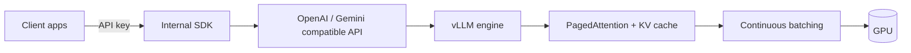
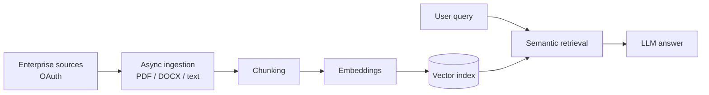

<div align="center">


<a href="https://github.com/YOUR_GITHUB_USERNAME">
  
</a>

<br/><br/>

<a href="https://www.linkedin.com/in/YOUR_LINKEDIN_USERNAME"></a>
<a href="mailto:Jashwanthsai678@gmail.com"></a>


</div>

<br/>

```bash
$ whoami
jashwanth  # AI Engineer @ VitaInspire

$ cat focus.txt
self-hosted LLM serving  |  RAG platforms  |  multi-agent workflows  |  multimodal systems

$ cat domains.txt
healthcare, education, enterprise knowledge management
```

## 👨‍💻 About

I build production AI systems for healthcare and education. Most of my work sits where models meet backend engineering: serving LLMs efficiently on self-hosted infrastructure, wiring retrieval pipelines to real documents, and putting agents behind APIs with proper authentication and role-based access.

I care about the unglamorous parts that make AI usable in production: throughput, latency, data isolation, and clean API contracts.

## 🔭 What I Build

| | |
|---|---|
| **LLM serving** | Multimodal models on vLLM with OpenAI- and Gemini-compatible endpoints, so apps can leave third-party providers without code rewrites |
| **RAG platforms** | Ingestion, chunking, embedding, and retrieval that keep enterprise knowledge bases continuously synced |
| **Agent workflows** | Stateful LangGraph pipelines using function calling, structured outputs, and RBAC data isolation |
| **Multimodal AI** | Video-to-video RAG that turns training videos into contextual video answers |
| **Clinical AI** | Guardrailed LLM agents for documentation, summarization, and entity extraction against EHR databases |

## 🧰 Stack

| Layer | Tools |
|---|---|
| **Languages** |      |
| **GenAI & Serving** |     |
| **Backend** |    |
| **Data** |      |
| **Cloud & Ops** |       |

**Inference optimization:** `PagedAttention` · `KV Cache` · `Continuous Batching` · `Quantization` · `LoRA` · `GPU Optimization`

## 🧩 How My Systems Work

<details>
<summary><b>Self-hosted LLM platform</b> - request path</summary>

<br/>



</details>

<details>
<summary><b>Live Sync RAG platform</b> - ingestion to answer</summary>

<br/>



</details>

## 📂 Selected Projects

<details>
<summary><b>Self-Hosted Multimodal LLM Platform</b></summary>

- High-concurrency multimodal model serving on vLLM
- OpenAI- and Gemini-compatible endpoints for migrating off external providers
- Internal SDK with API-key authentication
- Stack: `vLLM` `PagedAttention` `KV Cache` `Quantization`

</details>

<details>
<summary><b>Live Sync RAG Platform</b></summary>

- Continuously synchronized enterprise knowledge bases
- Async ingestion, chunking, embedding, and retrieval for PDF, DOCX, and text
- OAuth-secured knowledge source sync
- Stack: `RAG` `Vector DB` `Async Python` `OAuth`

</details>

<details>
<summary><b>Multimodal Video-to-Video RAG</b></summary>

- Processes training videos, with or without audio, and answers with contextual video
- Speech extraction, semantic retrieval, LLM reasoning, and video generation
- Stack: `Embeddings` `Multimodal Retrieval` `LLMs`

</details>

<details>
<summary><b>AI-Integrated Educational Platform</b></summary>

- Multi-tenant platform with stateful multi-agent workflows
- Function calling and structured JSON outputs for evaluation and compliance
- RBAC isolation across teachers, administrators, and students
- Stack: `LangGraph` `Function Calling` `RBAC`

</details>

<details>
<summary><b>AI-Powered Telehealth Platform</b></summary>

- Conversational agents for clinical documentation, connected to EHR databases
- Zero-shot and few-shot classification with guardrails for summarization and entity extraction
- Low-latency async API workflows
- Stack: `LLMs` `NER` `Async APIs`

</details>

<sub>Most of these were built professionally, so public repo links will be added as they become available.</sub>

## 🎓 Beyond Work

- B.Tech in Computer Science (AI & ML), Marri Laxman Reddy Institute of Technology and Management
- Selected for the National Innovation Design and Entrepreneurship Bootcamp 2024
- 300+ problems solved across LeetCode, HackerRank, and CodeChef
- Run AI/ML workshops, hackathons, and mentoring sessions for students and junior developers

## 📊 GitHub

<p>
  
  
</p>


