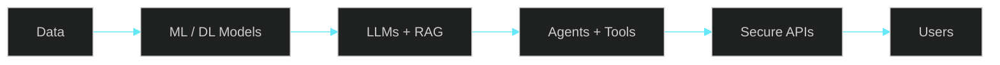

<div align="center">


<a href="https://github.com/jashwanthsai678">
  
</a>

<br/><br/>

<a href="https://www.linkedin.com/in/djashwanthsai96"></a>
<a href="https://github.com/jashwanthsai678?tab=repositories"></a>
<a href="mailto:Jashwanthsai678@gmail.com"></a>


</div>

<br/>

```python
engineer = {
    "name":        "Dodda Jashwanth Sai",
    "role":        "AI Engineer",
    "focus":       ["LLMs", "AI Agents", "RAG", "Machine Learning", "Deep Learning"],
    "foundations": ["Data Science", "Data Structures & Algorithms", "System Design"],
    "builds":      ["ML/DL models", "AI workflows", "autonomous agents", "self-hosted AI systems"],
    "open_source": ["MoCICD", "CanIRunLLM"],
}
```

<br/>

## About

AI Engineer with strong fundamentals in machine learning, deep learning, and data science. I build models, LLM-powered workflows, and agents, and ship them as reliable, production-ready services, including self-hosted deployments. My work spans healthcare and education, and I publish open-source tools for the AI ecosystem.

<br/>

## How I Build AI Systems



<br/>

## Open-Source Projects

<table>
<tr>
<td width="50%" valign="top">

**MoCICD** &nbsp;·&nbsp; `Apache-2.0`

Continuous model discovery, sandboxed benchmarking, and human-approved promotion for every place an application calls an LLM.

`Python` `Flask` `LLM Evaluation` `Agentic Pipeline`

[Repository](https://github.com/jashwanthsai678/Modus) &nbsp;·&nbsp; [Live site](https://modus-rouge.vercel.app)

</td>
<td width="50%" valign="top">

**CanIRunLLM** &nbsp;·&nbsp; `MIT` &nbsp;·&nbsp; `PyPI`

Scans your hardware and tells you which open-source LLMs your machine can run, with a local dashboard and one-click model setup.

`Python` `Local LLMs` `Ollama` `llama.cpp`

[Repository](https://github.com/jashwanthsai678/CaniRunLLM) &nbsp;·&nbsp; [PyPI](https://pypi.org/project/canirunllm/) &nbsp;·&nbsp; [Live site](https://cani-run-llm.vercel.app)

</td>
</tr>
</table>

<p align="center">
  <a href="https://github.com/jashwanthsai678/Modus"></a>
  <a href="https://github.com/jashwanthsai678/CaniRunLLM"></a>
</p>

<br/>

## Capabilities

| Area | What I do |
|:---|:---|
| **Machine Learning & Deep Learning** | Train, evaluate, and optimize classical ML, neural networks, and computer vision models |
| **LLMs & Generative AI** | Prompt engineering, function calling, structured outputs, fine-tuning (LoRA), model serving |
| **RAG & Retrieval** | Embeddings, semantic search, document pipelines, vector databases |
| **Agents & Workflows** | Stateful multi-step agents and tool-using workflows with LangChain and LangGraph |
| **Multimodal AI** | Systems combining text, speech, and video |
| **AI Backends** | Async, authenticated, role-secured APIs that put models in front of users |

<br/>

## Tech Stack

| | |
|:---|:---|
| **Languages** |      |
| **ML & Deep Learning** |      |
| **Data Science** |    |
| **GenAI & Agents** |     |
| **Backend** |    |
| **Databases** |     |
| **Cloud & DevOps** |       |

**Fundamentals:** `Data Structures & Algorithms` · `OOP` · `System Design` · `DBMS` · `Operating Systems` · `Computer Networks`

<br/>

## Education & Recognition

- **B.Tech, Computer Science (AI & ML)**, Marri Laxman Reddy Institute of Technology and Management
- Certifications: Google Cybersecurity, Machine Learning, Artificial Intelligence, Data Science & Analytics
- Selected for the National Innovation Design and Entrepreneurship Bootcamp 2024
- 300+ coding problems solved across LeetCode, HackerRank, and CodeChef
- Conducted AI/ML workshops, hackathons, and mentoring sessions for students and junior developers

<br/>

## GitHub

<p>
  
  
</p>

<br/>

## Connect

<a href="https://www.linkedin.com/in/djashwanthsai96"></a>
<a href="https://github.com/jashwanthsai678"></a>
<a href="mailto:Jashwanthsai678@gmail.com"></a>


